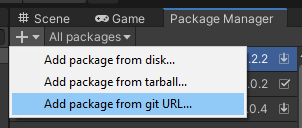

# Script Define Symbols Editor
Script Define Symbols Editor is an Unity Editor Window that able to manage script define symbols per build. Created by Thanut Panichyotai (@[LuviKunG]((https://github.com/LuviKunG)))

## How to use?

To open Script Define Symbols Editor, simply go to your Unity menu bars and select **Window/LuviKunG/Script Define Symbols Editor**


You will see a list of your script define symbols that you setup in unity project. Also you can manage, add, remove or sort your script define symbols as you want.

On the tool bar,
- **Revert** will revert all your changes into the last setup.
- **Apply** will apply your changes. This will made Unity Editor recompile all of your scripts.
- **Build Selection** is a drop down menu that will switch the current script define symbols to the other build. Note that Unity Editor will separate script define symbol for every different build.

## How to install?

### UPM Install via manifest.json

Locate to your Unity Project. In *Packages* folder, you will see a file named **manifest.json**. Open it with your text editor (such as Notepad++ or Visual Studio Code or Legacy Notepad)

Then merge this json format below.

(Do not just copy & paste the whole json! If you are not capable to merge json, please using online JSON merge tools like [this](https://tools.knowledgewalls.com/onlinejsonmerger))

```json
{
  "dependencies": {
    "com.luvikung.sdseditor": "https://github.com/LuviKunG/ScriptDefineSymbolsEditor.git#1.0.1"
  }
}
```

If you want to install the older version, please take a look at release tag in this git, then change the path after **#** to the version tag that you want.

### Unity 2019.3 Git URL

In Unity 2019.3 or greater, Package Manager is include the new feature that able to install the package via Git.



Just simply using this git URL and following with version like this example.

**https://github.com/LuviKunG/ScriptDefineSymbolsEditor.git#1.0.1**

Make sure that you're select the latest version.

### Unity UPM Git Extension (For 2019.2 and older version)

If you doesn't have this package before, please redirect to this git [https://github.com/mob-sakai/UpmGitExtension](https://github.com/mob-sakai/UpmGitExtension) then follow the instruction in README.md to install the **UPM Git Extension** to your Unity.

If you already installed. Open the **Package Manager UI**, you will see the git icon around the bottom left connor, Open it then follow the instruction using this git URL to perform package install.

Make sure that you're select the latest version.